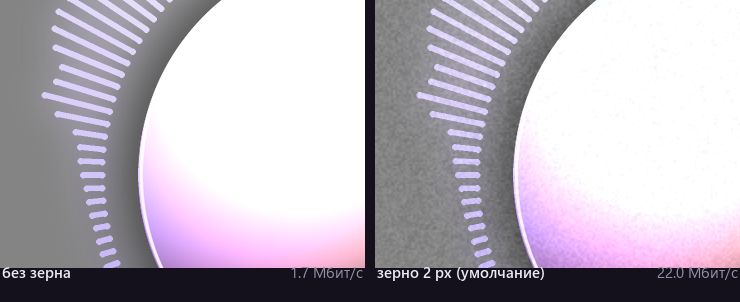
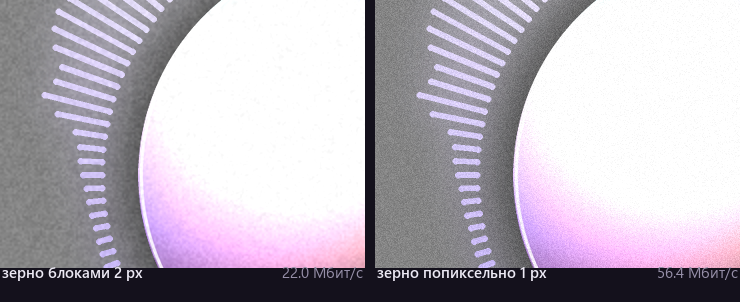

# music-video-generator

[](https://github.com/ialakey/music-video-generator/actions/workflows/tests.yml)
[](https://www.python.org/downloads/)
[](LICENSE)

**English** · [Русский](README.ru.md)

Turns an audio file and a picture into a finished YouTube "audio edit" clip:
blurred background with a slow zoom, cover art in the middle, a spectrum
visualizer, film grain, track titles and a progress bar. The audio can be
slowed down and drenched in reverb along the way — the classic
"slowed + reverb" treatment.


| `lofi` | `phonk` |
|--------|---------|
|  |  |

## What it does

- **6 visualizer styles**: `circle` (radial rays), `bars`, `mirror`, `wave`,
  `ring`, `dots` — every one of them reacts to the real spectrum, not to
  random numbers.
- **Audio processing**: slow down / speed up with pitch shift, reverb, bass
  boost, loudness normalization, fades.
- **Reacts to the music**: background zoom and shake on the beat, cover art
  pulsing with the bass, frame flash on a hit.
- **Background**: a single image, a folder of images (with crossfades), or a
  procedural gradient when there is no picture at all.
- **6 ready-made presets**, including a vertical `shorts` one for Reels/TikTok.
- **Parallel rendering** across CPU cores, piped frame by frame into ffmpeg.
- **Bilingual interface**: English and Russian, picked with `--lang` or from
  the system locale.

## Installation

You need Python 3.10+ and **ffmpeg** on your `PATH` (both `ffmpeg` and
`ffprobe` are used).

```bash
# Windows
winget install Gyan.FFmpeg
# macOS
brew install ffmpeg
# Linux
sudo apt install ffmpeg
```

Then:

```bash
git clone https://github.com/ialakey/music-video-generator.git
cd music-video-generator

python -m venv .venv
.venv/Scripts/activate        # Windows;  on macOS/Linux: source .venv/bin/activate
pip install -r requirements.txt
```

Two dependencies only — NumPy and Pillow. Everything else is the standard
library plus ffmpeg.

## Quick start

No files of your own? Generate a demo track and picture first:

```bash
python examples/make_demo_assets.py
python -m musicvideo examples/demo.wav -i examples/demo.jpg -p aesthetic
```

On your own material:

```bash
python -m musicvideo track.mp3 -i cover.jpg -p aesthetic -o output/video.mp4
```

Title and artist are taken from the file's tags; set them by hand if you like:

```bash
python -m musicvideo track.mp3 -i art.jpg --title "Way Down We Go" --artist "Kaleo"
```

### Trying things out without a full render

A full clip takes minutes, so it is easier to check settings on a single frame:

```bash
python -m musicvideo still track.mp3 -i art.jpg -p lofi --at 45 -o output/test.png
```

or on a short excerpt:

```bash
python -m musicvideo track.mp3 -i art.jpg --preview 10
```

## Presets

| Preset      | Look |
|-------------|------|
| `aesthetic` | slowed + reverb, round cover and radial spectrum — like the reference clips |
| `lofi`      | soft warm look, gentle wave, heavy slowdown |
| `phonk`     | aggressive mirrored bars, shake, red grade |
| `minimal`   | a thin ring around the cover, nothing else |
| `retro`     | VHS: scanlines, neon dots, heavy grain |
| `shorts`    | vertical 1080×1920 for Shorts/Reels/TikTok |

```bash
python -m musicvideo presets          # the list with descriptions
```

## Common tasks

```bash
# "slowed + reverb" by hand
python -m musicvideo track.mp3 -i art.jpg --speed 0.85 --reverb 0.45 --bass 3

# slideshow: every image in a folder, with crossfades
python -m musicvideo track.mp3 -i pics/ -p aesthetic

# vertical video for Shorts
python -m musicvideo track.mp3 -i art.jpg -p shorts -o output/short.mp4

# just the chorus, bars at the bottom, custom colors
python -m musicvideo track.mp3 -i art.jpg --start 62 --length 40 \
    --style bars --color "#ff2d4a" --color2 "#ffffff"

# no cover art and no progress bar
python -m musicvideo track.mp3 -i art.jpg --no-cover --no-progress
```

Every subcommand and flag: [docs/cli.md](docs/cli.md).

## Interface language

Help, progress and error messages come in English and Russian. The language is
taken from `--lang`, else from `MUSICVIDEO_LANG`, else from the system locale,
falling back to English:

```bash
python -m musicvideo track.mp3 -i art.jpg --lang ru    # this run only
export MUSICVIDEO_LANG=ru                              # this shell
```

Details, and the few strings argparse keeps in English, are in
[docs/cli.md#language](docs/cli.md#language).

## Fine-tuning through JSON

Presets and flags do not cover everything. The full config lives in
`config.example.json`; to get the current values with every default filled in:

```bash
python -m musicvideo dump-config track.mp3 -p aesthetic --dump-to my.json
python -m musicvideo track.mp3 -c my.json
```

Priority: defaults → preset → config file → command-line flags. Partial
sections are fine — `{"visualizer": {"color": "#ff0000"}}` changes only the
color and leaves the rest of the visualizer as the preset left it.

### Key parameters

| Section | Parameter | Meaning |
|---------|-----------|---------|
| `audio` | `speed` | `0.85` — slowed, `1.15` — sped up (pitch moves with it) |
| `audio` | `reverb`, `reverb_room` | amount and tail length of the reverb |
| `background` | `blur`, `brightness`, `zoom` | blur, darkening and the slow background zoom |
| `background` | `beat_zoom`, `shake` | how the background reacts to bass and hits |
| `background` | `grain` | film grain; has a big effect on file size |
| `cover` | `shape`, `size`, `spin` | shape, size and "vinyl" rotation |
| `visualizer` | `style`, `radius`, `amplitude` | look and geometry of the spectrum |
| `visualizer` | `range` | which frequencies to show: `full`/`bass`/`mid`/`high` |
| `analysis` | `attack`, `decay` | how sharply the bands react to the sound |
| `video` | `crf` | quality: 18 is near-lossless, 20–23 is the usual choice |

Every field is documented in [docs/configuration.md](docs/configuration.md).

Sizes (`size`, `radius`, `amplitude`, font sizes) are given in pixels for a
frame whose short side is 1080, so horizontal and vertical formats end up
looking the same. Positions are fractions of the frame: `[0.5, 0.44]` means
centered horizontally, 44 % of the height from the top.

A useful rule: to keep the visualizer clear of the cover art,
`visualizer.radius` must be larger than half of `cover.size` (for a square
cover — larger than `cover.size * 0.71`).

## Fonts

Fonts are looked up in `assets/fonts` first, then among the system ones. Drop
your own `.ttf` there and name the file:

```json
{ "text": { "title": { "font": "Montserrat-SemiBold" } } }
```

## File size: grain is what matters

Film grain is random noise, and the codec cannot predict it from one frame to
the next, so it pays for it again on every single frame. Measured on the demo
clip — 1080p/30, CRF 21, `aesthetic` preset, the same 6 seconds, video stream
only:

| Setting | Bitrate | Three-minute track | vs. no grain |
|---------|--------:|-------------------:|-------------:|
| `grain: 0` (off)              |  1.7 Mbit/s | 36 MB   | — |
| `grain_size: 4`               | 14.8 Mbit/s | 317 MB  | ×8.8 |
| `grain_size: 2` (default)     | 22.0 Mbit/s | 472 MB  | ×13.0 |
| `grain_size: 1` (per-pixel)   | 56.4 Mbit/s | 1210 MB | ×33.4 |



*The same crop, 1:1 pixels. Barely a texture — and thirteen times the file.*

Grain is the single most expensive thing in the frame: it multiplies the file
by thirteen. That is why it is generated in 2-pixel blocks by default — it
looks like film rather than digital noise, and costs 2.6× less than per-pixel
noise.



*Left: noise generated at half resolution and scaled up. Right: per-pixel.
Hard to tell apart, 2.6× apart in bitrate.*

CRF on the same grainy picture, with VMAF measured against a lossless master:

| CRF | Bitrate | Three-minute track | VMAF |
|-----|--------:|-------------------:|-----:|
| 18  | 33.8 Mbit/s | 725 MB | 97.6 |
| 21 (default) | 22.0 Mbit/s | 472 MB | 95.0 |
| 23  | 15.2 Mbit/s | 326 MB | 93.0 |
| 26  |  6.8 Mbit/s | 146 MB | 89.4 |

CRF 18 costs 1.5× the size of CRF 21 for 2.6 VMAF points — which is why 21 is
the default. If the file is still too big:

```bash
python -m musicvideo track.mp3 -i art.jpg --grain 0      # no grain at all
python -m musicvideo track.mp3 -i art.jpg --crf 23       # stronger compression
```

Grain is also the content type where a modern codec pulls furthest ahead. At a
matched VMAF of ~93, the same clip needs 15.2 Mbit/s with x264 but only
4.4 Mbit/s with AV1 — 3.5× less. The default stays x264 because it plays
everywhere and encodes in seconds rather than minutes.

## Performance

Rendering runs in several processes (`--workers`; by default, one less than the
number of cores). Measured on the demo clip: 702 frames of 1080p/30 with grain
on, 8 cores / 7 workers — 76 seconds, or 9.2 frames per second. That puts a
three-minute track at roughly ten minutes. What speeds it up:

- `--fps 24` instead of 30;
- `--size 1280x720` for drafts;
- `--grain 0` — grain slows down encoding as well;
- `video.preset: "veryfast"` — faster, but a bigger file.

## Using it from your own code

```python
from musicvideo.config import load_config
from musicvideo.render import render_video

def main():
    cfg = load_config(None, {"audio_file": "track.mp3",
                             "background": {"image": "art.jpg"}}, preset="aesthetic")
    print(render_video(cfg))

if __name__ == "__main__":   # required: rendering uses several processes
    main()
```

The `if __name__ == "__main__":` block is not a formality: without it the
worker processes re-import your script and start the render recursively. The
alternative is to set `workers: 1` in the config.

More in [docs/api.md](docs/api.md).

## Layout

```
musicvideo/
  cli.py          argument parsing, render/still/presets/dump-config subcommands
  config.py       settings schema, preset -> file -> CLI merging
  presets.py      ready-made visual presets
  ffmpeg.py       decoding, audio effects, video encoding
  audio.py        FFT, frequency bands, bass envelopes and beat detection
  draw.py         colors, fonts, antialiased layers, glow
  render.py       frame assembly and the render pipeline
  i18n.py         the English/Russian message catalog
  layers/         background, cover, visualizer, text, overlays
docs/
  cli.md              every subcommand and flag
  configuration.md    every config field
  api.md              using the package from Python
```

## Tests

```bash
python -m pytest tests -q
```

The tests cover config merging, the CLI, audio analysis and the drawing
helpers; they do not render video and do not need ffmpeg.

## License and rights

The code is MIT-licensed — see [LICENSE](LICENSE). The music and the images
are not covered by it: publishing a clip requires the rights to the track and
to the picture. The demo track and picture in `examples/` are generated by
`examples/make_demo_assets.py` and carry no third-party rights.

Fonts are not bundled for the same reason — licenses differ. Drop your own
`.ttf` into `assets/fonts`; the system fonts are used otherwise.
