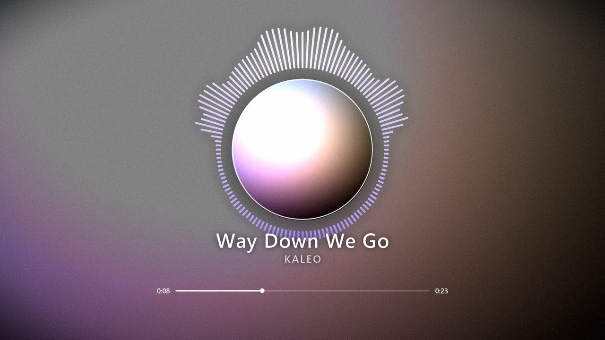
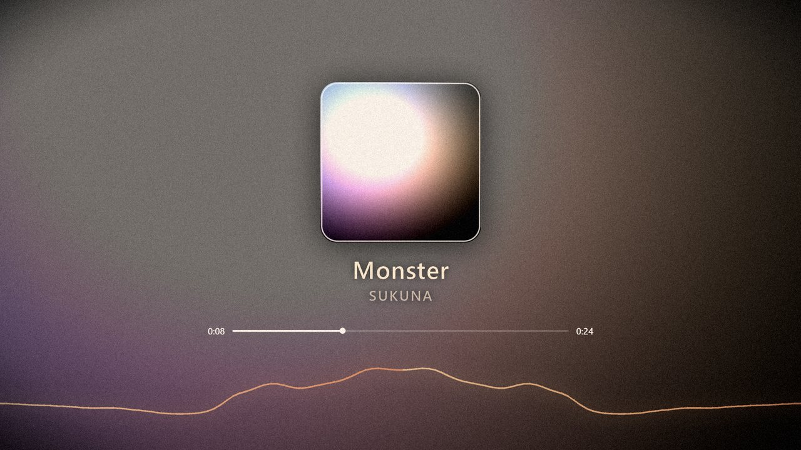
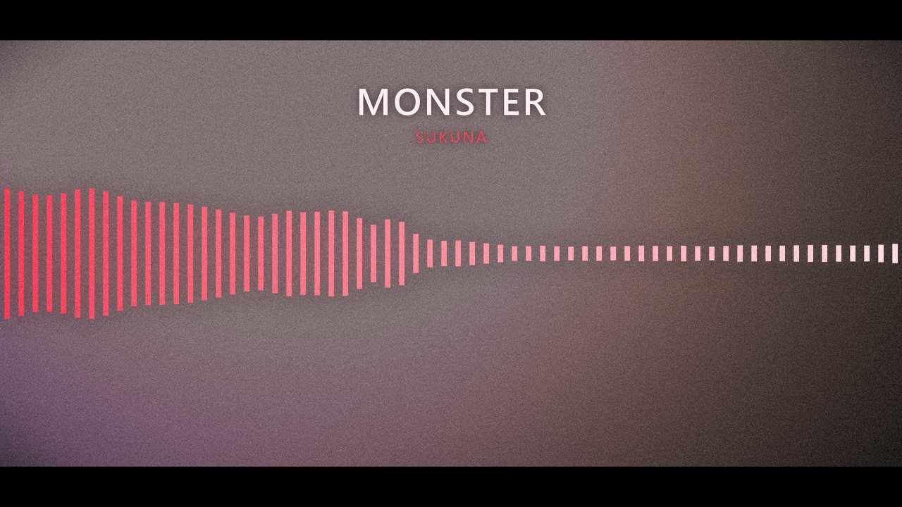

# music-video-generator

[](https://github.com/ialakey/music-video-generator/actions/workflows/tests.yml)
[](https://www.python.org/downloads/)
[](LICENSE)

[English](README.md) · **Русский**

Собирает из аудиофайла и картинки готовый ролик в стиле YouTube «audio edit»:
размытый фон с медленным зумом, обложка по центру, визуализатор спектра,
плёночное зерно, название трека и полоса воспроизведения. Звук при этом можно
замедлить и добавить реверберацию — тот самый «slowed + reverb».



| `lofi` | `phonk` |
|--------|---------|
|  |  |

## Что умеет

- **6 стилей визуализатора**: `circle` (лучи по кругу), `bars`, `mirror`,
  `wave`, `ring`, `dots` — все реагируют на реальный спектр, а не на случайные
  числа.
- **Обработка звука**: замедление/ускорение с изменением высоты тона,
  реверберация, усиление баса, нормализация громкости, фейды.
- **Реакция на музыку**: зум и тряска фона на бит, пульсация обложки от баса,
  засветка кадра на удар.
- **Фон**: одна картинка, папка с картинками (с кроссфейдом) или процедурный
  градиент, если картинки нет вовсе.
- **6 готовых пресетов**, включая вертикальный `shorts` для Reels/TikTok.
- **Параллельный рендер** по числу ядер и покадровая сборка через ffmpeg.
- **Двуязычный интерфейс**: английский и русский, выбирается флагом `--lang`
  или по локали системы.

## Установка

Нужны Python 3.10+ и **ffmpeg** в `PATH` (используются `ffmpeg` и `ffprobe`).

```bash
# Windows
winget install Gyan.FFmpeg
# macOS
brew install ffmpeg
# Linux
sudo apt install ffmpeg
```

Затем:

```bash
git clone https://github.com/ialakey/music-video-generator.git
cd music-video-generator

python -m venv .venv
.venv/Scripts/activate        # Windows;  на macOS/Linux: source .venv/bin/activate
pip install -r requirements.txt
```

Зависимостей всего две — NumPy и Pillow. Остальное — стандартная библиотека
и ffmpeg.

## Быстрый старт

Без своих файлов — сгенерируйте демо-трек и картинку:

```bash
python examples/make_demo_assets.py
python -m musicvideo examples/demo.wav -i examples/demo.jpg -p aesthetic
```

На своём материале:

```bash
python -m musicvideo track.mp3 -i cover.jpg -p aesthetic -o output/video.mp4
```

Название и исполнитель подставляются из тегов файла; при желании — вручную:

```bash
python -m musicvideo track.mp3 -i art.jpg --title "Way Down We Go" --artist "Kaleo"
```

### Примерка без рендера

Полный ролик считается минутами, поэтому настройки удобно проверять на одном
кадре:

```bash
python -m musicvideo still track.mp3 -i art.jpg -p lofi --at 45 -o output/proba.png
```

или на коротком отрывке:

```bash
python -m musicvideo track.mp3 -i art.jpg --preview 10
```

## Пресеты

| Пресет      | Вид |
|-------------|-----|
| `aesthetic` | slowed + reverb, круглая обложка и радиальный спектр — как в референсе |
| `lofi`      | мягкий тёплый вид, плавная волна, сильный слоу |
| `phonk`     | агрессивные зеркальные бары, тряска, красный грейд |
| `minimal`   | тонкое кольцо вокруг обложки, ничего лишнего |
| `retro`     | VHS: полосы, неоновые точки, высокая зернистость |
| `shorts`    | вертикальный формат 1080×1920 для Shorts/Reels/TikTok |

```bash
python -m musicvideo presets          # список с описаниями
```

## Частые задачи

```bash
# «slowed + reverb» вручную
python -m musicvideo track.mp3 -i art.jpg --speed 0.85 --reverb 0.45 --bass 3

# слайдшоу: все картинки из папки, с кроссфейдом
python -m musicvideo track.mp3 -i pics/ -p aesthetic

# вертикальное видео для Shorts
python -m musicvideo track.mp3 -i art.jpg -p shorts -o output/short.mp4

# только припев, бары внизу, свои цвета
python -m musicvideo track.mp3 -i art.jpg --start 62 --length 40 \
    --style bars --color "#ff2d4a" --color2 "#ffffff"

# без обложки и полосы прогресса
python -m musicvideo track.mp3 -i art.jpg --no-cover --no-progress
```

Все подкоманды и флаги: [docs/cli.ru.md](docs/cli.ru.md).

## Язык интерфейса

Справка, прогресс и сообщения об ошибках есть на английском и русском. Язык
берётся из `--lang`, иначе из `MUSICVIDEO_LANG`, иначе из локали системы;
запасной вариант — английский:

```bash
python -m musicvideo track.mp3 -i art.jpg --lang ru    # только этот запуск
export MUSICVIDEO_LANG=ru                              # на всю сессию оболочки
```

Подробности и перечень строк, которые argparse оставляет английскими, —
в [docs/cli.ru.md#язык](docs/cli.ru.md#язык).

## Тонкая настройка через JSON

Пресеты и флаги покрывают не всё. Полный конфиг — в `config.example.json`;
чтобы получить текущие значения со всеми умолчаниями:

```bash
python -m musicvideo dump-config track.mp3 -p aesthetic --dump-to my.json
python -m musicvideo track.mp3 -c my.json
```

Приоритет: умолчания → пресет → файл конфига → флаги командной строки.
Частичные секции допустимы — `{"visualizer": {"color": "#ff0000"}}` меняет
только цвет, остальные параметры визуализатора остаются от пресета.

### Ключевые параметры

| Секция | Параметр | Смысл |
|--------|----------|-------|
| `audio` | `speed` | `0.85` — slowed, `1.15` — sped up (меняется и высота тона) |
| `audio` | `reverb`, `reverb_room` | количество и длина хвоста реверберации |
| `background` | `blur`, `brightness`, `zoom` | размытие, затемнение и медленный зум фона |
| `background` | `beat_zoom`, `shake` | реакция фона на бас и удары |
| `background` | `grain` | плёночное зерно; сильно влияет на размер файла |
| `cover` | `shape`, `size`, `spin` | форма, размер и вращение «винила» |
| `visualizer` | `style`, `radius`, `amplitude` | вид и геометрия спектра |
| `visualizer` | `range` | какие частоты показывать: `full`/`bass`/`mid`/`high` |
| `analysis` | `attack`, `decay` | насколько резко полосы реагируют на звук |
| `video` | `crf` | качество: 18 — почти без потерь, 20–23 — обычный выбор |

Каждое поле описано в [docs/configuration.ru.md](docs/configuration.ru.md).

Размеры (`size`, `radius`, `amplitude`, кегли шрифтов) задаются в пикселях для
кадра с короткой стороной 1080, поэтому горизонтальный и вертикальный форматы
выглядят одинаково. Позиции задаются долями кадра: `[0.5, 0.44]` — центр по
горизонтали, 44 % высоты сверху.

Полезное правило: чтобы визуализатор не пересекал обложку, `visualizer.radius`
должен быть больше половины `cover.size` (для квадратной обложки — больше
`cover.size * 0.71`).

## Шрифты

Ищутся в `assets/fonts`, затем среди системных. Положите туда свой `.ttf`
и укажите имя файла:

```json
{ "text": { "title": { "font": "Montserrat-SemiBold" } } }
```

## Размер файла: главное — зерно

Плёночное зерно — случайный шум, и кодек не может его предсказать между
кадрами, поэтому платит за него заново в каждом кадре. Замеры на демо-ролике —
1080p/30, CRF 21, пресет `aesthetic`, одни и те же 6 секунд, только видеопоток:

| Настройка | Битрейт | Трёхминутный трек | против «без зерна» |
|-----------|--------:|------------------:|-------------------:|
| `grain: 0` (выключено)        |  1.7 Мбит/с | 36 МБ   | — |
| `grain_size: 4`               | 14.8 Мбит/с | 317 МБ  | ×8.8 |
| `grain_size: 2` (умолчание)   | 22.0 Мбит/с | 472 МБ  | ×13.0 |
| `grain_size: 1` (попиксельно) | 56.4 Мбит/с | 1210 МБ | ×33.4 |

Зерно — самая дорогая вещь в кадре: оно умножает файл на тринадцать. Поэтому
по умолчанию оно генерируется блоками по 2 пикселя: выглядит как плёнка,
а не как цифровой шум, и стоит в 2.6 раза дешевле попиксельного.

CRF на той же зернистой картинке, VMAF измерен относительно lossless-мастера:

| CRF | Битрейт | Трёхминутный трек | VMAF |
|-----|--------:|------------------:|-----:|
| 18  | 33.8 Мбит/с | 725 МБ | 97.6 |
| 21 (умолчание) | 22.0 Мбит/с | 472 МБ | 95.0 |
| 23  | 15.2 Мбит/с | 326 МБ | 93.0 |
| 26  |  6.8 Мбит/с | 146 МБ | 89.4 |

CRF 18 стоит в 1.5 раза больше места, чем CRF 21, ради 2.6 пункта VMAF —
поэтому умолчание именно 21. Если файл всё равно великоват:

```bash
python -m musicvideo track.mp3 -i art.jpg --grain 0      # совсем без зерна
python -m musicvideo track.mp3 -i art.jpg --crf 23       # сильнее сжатие
```

Зерно — ещё и тот тип картинки, где современный кодек отрывается сильнее
всего. При одинаковом VMAF ≈ 93 тому же ролику нужно 15.2 Мбит/с с x264
и только 4.4 Мбит/с с AV1 — в 3.5 раза меньше. По умолчанию остаётся x264:
он играется везде и кодирует за секунды, а не за минуты.

## Производительность

Рендер идёт в несколько процессов (`--workers`, по умолчанию — на один меньше
числа ядер). Ориентир для 1080p/30: примерно 4–7 минут на трёхминутный трек
на 8 ядрах. Что ускоряет:

- `--fps 24` вместо 30;
- `--size 1280x720` для черновиков;
- `--grain 0` — зерно замедляет ещё и кодирование;
- `video.preset: "veryfast"` — быстрее, но файл крупнее.

## Использование из своего кода

```python
from musicvideo.config import load_config
from musicvideo.render import render_video

def main():
    cfg = load_config(None, {"audio_file": "track.mp3",
                             "background": {"image": "art.jpg"}}, preset="aesthetic")
    print(render_video(cfg))

if __name__ == "__main__":   # обязательно: рендер использует несколько процессов
    main()
```

Блок `if __name__ == "__main__":` не формальность: без него процессы-воркеры
заново импортируют ваш скрипт и запускают рендер рекурсивно. Либо укажите
`workers: 1` в конфиге.

Подробнее — в [docs/api.ru.md](docs/api.ru.md).

## Структура

```
musicvideo/
  cli.py          разбор аргументов, подкоманды render/still/presets/dump-config
  config.py       схема настроек, слияние пресет → файл → CLI
  presets.py      готовые визуальные пресеты
  ffmpeg.py       декодирование, аудиоэффекты, кодирование видео
  audio.py        FFT, частотные полосы, огибающие баса и детекция ударов
  draw.py         цвета, шрифты, сглаженные слои, свечение
  render.py       сборка кадра и конвейер рендера
  i18n.py         каталог сообщений на двух языках
  layers/         фон, обложка, визуализатор, текст, оверлеи
docs/
  cli.ru.md              все подкоманды и флаги
  configuration.ru.md    все поля конфигурации
  api.ru.md              использование пакета из Python
```

## Тесты

```bash
python -m pytest tests -q
```

Тесты проверяют слияние конфигов, CLI, анализ звука и утилиты рисования;
видео они не рендерят и ffmpeg им не нужен.

## Лицензия и авторские права

Код под лицензией MIT — см. [LICENSE](LICENSE). На музыку и изображения она
не распространяется: для публикации ролика нужны права на трек и на картинку.
Демо-трек и картинка в `examples/` создаются скриптом
`examples/make_demo_assets.py` и ничьих прав не затрагивают.

Шрифты по той же причине не приложены — лицензии у всех разные. Положите свой
`.ttf` в `assets/fonts`; иначе берутся системные.
